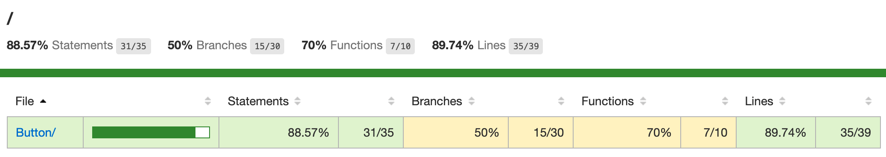

# The Button
Write a contract in Solidity that is similar to The Button on reddit (r/thebutton), where participants pay a fixed amount of ether to call press_button, and then if 3 blocks pass without someone calling press_button, whoever pressed the button last can call claim_treasure and get the other participants’ deposits. 

## Ropsten
`https://ropsten.etherscan.io/address/0x61e3cdea9e1e39d5aba746622859888bd17acf28#code`
```bash
npx hardhat run --network ropsten ./scripts/Button/deploy.ts
npx hardhat verify --network ropsten 0x61E3CdEA9E1e39D5abA746622859888Bd17aCf28 "100000"
```

## Run
```bash
yarn && yarn run build && yarn run compile && yarn run test

output => 

No need to generate any newer typings.

  Setup Admin and Unnamed Accounts
    Creating Button Contract
Deployed Button to the following address => 0x90dEC914c747045F8036Cebb4827A46cEe848783
deployed contract to => 0x90dEC914c747045F8036Cebb4827A46cEe848783:0 (wei)
      ✓ should return Button contract constructor initial state
(+)     0xcDe03ae571aAbe406FCac8296EE24a55f1D19c8a:9999991984816000000000
(0)     0x5bb11F8087bE322F110d3D06Ccf16d839c6C72a0:10000000000000000000000
(1)     0xb3E637B3c8c6C7cAd00D1B4E2c6628723eB6A037:10000000000000000000000
(2)     0xef95d32294087Bb39f9e341bed818b29E748645A:10000000000000000000000
(3)     0xede461b4E12471c57B7C9f89C4FeaCb58be8F386:10000000000000000000000
(4)     0x3cd7eb825Cb19edbb48793542B2Bb0476089A681:10000000000000000000000
(5)     0x8EA39084d9863c7EBB797Ce4D79130e8f5BD56a5:10000000000000000000000
(6)     0xB750Ddc85418ba9586DA6690bD2bbed5B26cec43:10000000000000000000000
(7)     0xc1dca522aD1201F74026e2b648C8233C9725Ff4A:10000000000000000000000
(8)     0xf776Cc0f3048ecCF3C5F3CBC84722E07Cc14442C:10000000000000000000000
(9)     0x19bE5bd4F9EF7c9638f9A0798cbCdA5559A9AdB9:10000000000000000000000
(10)    0x3C21aED89f36eCFc6D8Fd61AD0c31a2073bfE365:10000000000000000000000
(11)    0x27Bf861d0023DAd1A5Fa5973434CEaa5dE6EC956:10000000000000000000000
(12)    0x3A8067F68A1Ef4546038718944C09b4015BbB8cD:10000000000000000000000
(13)    0x912C2B9d4cfB39Ba150413cBf42D5541fdA5d8E1:10000000000000000000000
(14)    0x95F05CdA736366C2FEeE974dEf1211a6F77A5acC:10000000000000000000000
(15)    0xf0d95557b08a4320939669B31821F57576252D05:10000000000000000000000
(16)    0x476644De11a2B90Bb91070743038cd989CE6436F:10000000000000000000000
(17)    0x43189748eEd71b22Ae6D9d69E967E3Dc1a72815D:10000000000000000000000
(18)    0xD05466611A52A267411F16468f2E32c0a6142892:10000000000000000000000
🎉🎉🎉 Let\'s push buttons
      ✓ should display other unnamed addresses and balances

author:Mark Phillips
minimum fee:100000
      ✓ should display contract properties
0x5bb11F8087bE322F110d3D06Ccf16d839c6C72a0:10000000000000000000000:
button_pushed by 0x5bb11f8087be322f110d3d06ccf16d839c6c72a0 contributing 100000
(2)(0) 0x5bb11F8087bE322F110d3D06Ccf16d839c6C72a0 ➡️  Button:0x90dEC914c747045F8036Cebb4827A46cEe848783
        🎰 button push:100000 (⛽ 98080)
        tx:0x42ef403a1d5aeb319d21306be5278c9a69f44a5f695a2e99bebb0772b264a5d5:2
0xb3E637B3c8c6C7cAd00D1B4E2c6628723eB6A037:10000000000000000000000:
button_pushed by 0xb3e637b3c8c6c7cad00d1b4e2c6628723eb6a037 contributing 100000
(3)(1) 0xb3E637B3c8c6C7cAd00D1B4E2c6628723eB6A037 ➡️  Button:0x90dEC914c747045F8036Cebb4827A46cEe848783
        🎰 button push:100000 (⛽ 80980)
        tx:0x057f9e0413c7759bf93f9669b379dec0e6152771bf76efbfd3e52b725d988a5c:3
0xef95d32294087Bb39f9e341bed818b29E748645A:10000000000000000000000:
button_pushed by 0xef95d32294087bb39f9e341bed818b29e748645a contributing 100000
(4)(2) 0xef95d32294087Bb39f9e341bed818b29E748645A ➡️  Button:0x90dEC914c747045F8036Cebb4827A46cEe848783
        🎰 button push:100000 (⛽ 101104)
        tx:0xf1fb068e61747b48f0d1220c04ea6ba18102464e885236b9a7f8a66c52d4b291:4
Button 0x90dEC914c747045F8036Cebb4827A46cEe848783 contract balance:300000, playerCount:3

Forward 3 blocks:
advancing:(4):
        0x7703bad1a2dd6522cec9b9bafd2483140b0c5421358bf40e52f99a0ad55c123f
        0x11ddc4acf377bdf3b0c865eee2ec53af7b809d1c122873851a7e6534791bbe69
        1626046830:4, 0x0000000000000042, 131264
        12450000, 101104
        tx:0xf1fb068e61747b48f0d1220c04ea6ba18102464e885236b9a7f8a66c52d4b291
        current block time:1626046830 => adv block time:1626133230
advancing:(5):
        0x11ddc4acf377bdf3b0c865eee2ec53af7b809d1c122873851a7e6534791bbe69
        0x3d2d6a1c0799a5d10e524a3eabb21351f9cbd282d33527cd5f98a216aed7b6cb
        1626133230:5, 0x0000000000000042, 131072
        12450000, 0
        tx:
        current block time:1626133230 => adv block time:1626219630
advancing:(6):
        0x3d2d6a1c0799a5d10e524a3eabb21351f9cbd282d33527cd5f98a216aed7b6cb
        0xae9cd9a0d92f63cd452ecc2b0cd5e41bfde9beca7be67566298a5a4ea54382d9
        1626219630:6, 0x0000000000000042, 131072
        12450000, 0
        tx:
        current block time:1626219630 => adv block time:1626306030

Winner Winner Chicken Dinner:0xef95d32294087Bb39f9e341bed818b29E748645A - let\'s claim_treasure.
Winner Winner Chicken Dinner:0xef95d32294087bb39f9e341bed818b29e748645a of 300000 (wei)

Collection block no.:7, current block no.:8
(8) 0xef95d32294087Bb39f9e341bed818b29E748645A => 
        9999998880040000200000 (⛽ 38891)
        tx:0x90da700a8854b049495c2585e72405c8bc8feeebdcb548045e0ea529fafe3caa:8
Button balance after payout => 0
0x5bb11F8087bE322F110d3D06Ccf16d839c6C72a0:9999999215359999900000:
button_pushed by 0x5bb11f8087be322f110d3d06ccf16d839c6c72a0 contributing 100000
(9)(0) 0x5bb11F8087bE322F110d3D06Ccf16d839c6C72a0 ➡️  Button:0x90dEC914c747045F8036Cebb4827A46cEe848783
        🎰 button push:100000 (⛽ 98080)
        tx:0x6468e52f3a40a8d5fd592b62f301141feb8426c9ad450660f84926f8381f42c8:9
0xb3E637B3c8c6C7cAd00D1B4E2c6628723eB6A037:9999999352159999900000:
button_pushed by 0xb3e637b3c8c6c7cad00d1b4e2c6628723eb6a037 contributing 100000
(10)(1) 0xb3E637B3c8c6C7cAd00D1B4E2c6628723eB6A037 ➡️  Button:0x90dEC914c747045F8036Cebb4827A46cEe848783
        🎰 button push:100000 (⛽ 80980)
        tx:0x98e5b6f8c0704527525c5840e08ee9610f5ed14768a0ec33fd59fbf6c27805f9:10
0xef95d32294087Bb39f9e341bed818b29E748645A:9999998880040000200000:
button_pushed by 0xef95d32294087bb39f9e341bed818b29e748645a contributing 100000
(11)(2) 0xef95d32294087Bb39f9e341bed818b29E748645A ➡️  Button:0x90dEC914c747045F8036Cebb4827A46cEe848783
        🎰 button push:100000 (⛽ 101104)
        tx:0x428e0bb5916fa78f9201dc7e51ab0f3837051c502039911d958945bfa7a79776:11
Button 0x90dEC914c747045F8036Cebb4827A46cEe848783 contract balance:300000, playerCount:3

Forward 3 blocks:
advancing:(11):
        0x80208b8c9ec7f4f3e9e512c2495eb160ed7e83d50ba553e2540f0c025b9230ad
        0xfd14ada2a0c9bb54184b2e7d2e88379bb0928a74626abf5b19b0797dc7a88dd8
        1626306034:11, 0x0000000000000042, 131328
        12450000, 101104
        tx:0x428e0bb5916fa78f9201dc7e51ab0f3837051c502039911d958945bfa7a79776
        current block time:1626306034 => adv block time:1626392434
advancing:(12):
        0xfd14ada2a0c9bb54184b2e7d2e88379bb0928a74626abf5b19b0797dc7a88dd8
        0x3fbfc80d194e5d8f8fbb94cc30a984dce361eb0fa22a9659fcb606b2342a72e7
        1626392434:12, 0x0000000000000042, 131072
        12450000, 0
        tx:
        current block time:1626392434 => adv block time:1626478834
advancing:(13):
        0x3fbfc80d194e5d8f8fbb94cc30a984dce361eb0fa22a9659fcb606b2342a72e7
        0x263dcadc0ee8b10d321b1a165424870803b98d5b6da6e4797a6ff2672ab92175
        1626478834:13, 0x0000000000000042, 131072
        12450000, 0
        tx:
        current block time:1626478834 => adv block time:1626565234

Winner Winner Chicken Dinner:0xef95d32294087Bb39f9e341bed818b29E748645A - let\'s claim_treasure.
Winner Winner Chicken Dinner:0xef95d32294087bb39f9e341bed818b29e748645a of 300000 (wei)

Collection block no.:14, current block no.:15
(15) 0xef95d32294087Bb39f9e341bed818b29E748645A => 
        9999997760080000400000 (⛽ 38891)
        tx:0xca2f1eac94a6fb53587066105a781c291d45de300cb4f140a43fb52a0e4c35a1:15
Button balance after payout => 0
      ✓ should demonstrate players, balances, wagers and pushing buttons

(+)     0xcDe03ae571aAbe406FCac8296EE24a55f1D19c8a:9999991984816000000000
(0)     0x5bb11F8087bE322F110d3D06Ccf16d839c6C72a0:9999998430719999800000
(1)     0xb3E637B3c8c6C7cAd00D1B4E2c6628723eB6A037:9999998704319999800000
(2)     0xef95d32294087Bb39f9e341bed818b29E748645A:9999997760080000400000
(3)     0xede461b4E12471c57B7C9f89C4FeaCb58be8F386:10000000000000000000000
(4)     0x3cd7eb825Cb19edbb48793542B2Bb0476089A681:10000000000000000000000
(5)     0x8EA39084d9863c7EBB797Ce4D79130e8f5BD56a5:10000000000000000000000
(6)     0xB750Ddc85418ba9586DA6690bD2bbed5B26cec43:10000000000000000000000
(7)     0xc1dca522aD1201F74026e2b648C8233C9725Ff4A:10000000000000000000000
(8)     0xf776Cc0f3048ecCF3C5F3CBC84722E07Cc14442C:10000000000000000000000
(9)     0x19bE5bd4F9EF7c9638f9A0798cbCdA5559A9AdB9:10000000000000000000000
(10)    0x3C21aED89f36eCFc6D8Fd61AD0c31a2073bfE365:10000000000000000000000
(11)    0x27Bf861d0023DAd1A5Fa5973434CEaa5dE6EC956:10000000000000000000000
(12)    0x3A8067F68A1Ef4546038718944C09b4015BbB8cD:10000000000000000000000
(13)    0x912C2B9d4cfB39Ba150413cBf42D5541fdA5d8E1:10000000000000000000000
(14)    0x95F05CdA736366C2FEeE974dEf1211a6F77A5acC:10000000000000000000000
(15)    0xf0d95557b08a4320939669B31821F57576252D05:10000000000000000000000
(16)    0x476644De11a2B90Bb91070743038cd989CE6436F:10000000000000000000000
(17)    0x43189748eEd71b22Ae6D9d69E967E3Dc1a72815D:10000000000000000000000
(18)    0xD05466611A52A267411F16468f2E32c0a6142892:10000000000000000000000
      ✓ should display unnamed addresses and balances again

·-------------------------------|---------------------------|-------------|-----------------------------·
|      Solc version: 0.8.4      ·  Optimizer enabled: true  ·  Runs: 800  ·  Block limit: 12450000 gas  │
································|···························|·············|······························
|  Methods                                                                                              │
·············|··················|·············|·············|·············|···············|··············
|  Contract  ·  Method          ·  Min        ·  Max        ·  Avg        ·  # calls      ·  usd (avg)  │
·············|··················|·············|·············|·············|···············|··············
|  Button    ·  claim_treasure  ·          -  ·          -  ·      38891  ·            4  ·          -  │
·············|··················|·············|·············|·············|···············|··············
|  Button    ·  press_button    ·      80980  ·     101104  ·      93388  ·           12  ·          -  │
·············|··················|·············|·············|·············|···············|··············
|  Deployments                  ·                                         ·  % of limit   ·             │
································|·············|·············|·············|···············|··············
|  Button                       ·          -  ·          -  ·    1001898  ·          8 %  ·          -  │
·-------------------------------|-------------|-------------|-------------|---------------|-------------·

  6 passing (1s)

Time: 0h:00m:06s                                                                                                                                                                                                                                                             
```

### Coverage
